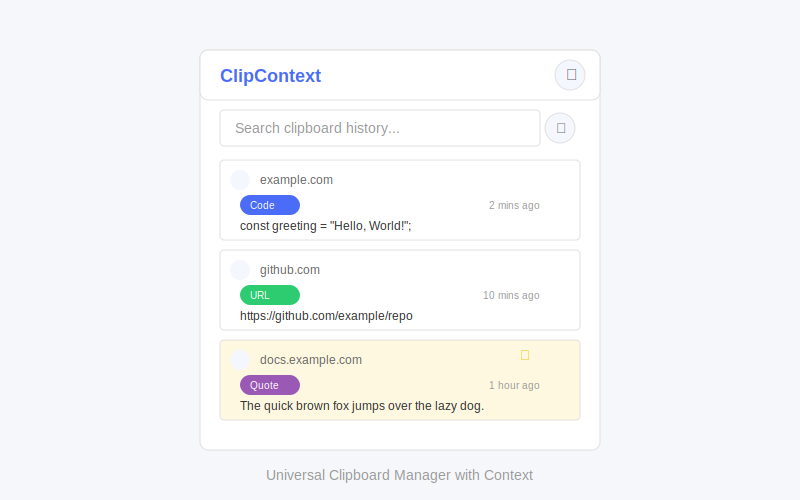

# Universal Clipboard Manager with Context (ClipContext)

A browser extension that enhances productivity by providing a persistent, searchable, and context-aware clipboard history. It automatically captures items copied within the browser, remembers their source (URL and page title), and utilizes AI to categorize the content, making retrieval intuitive and efficient.



## Features

-   **Persistent Clipboard History**: Never lose copied items again
-   **Context Awareness**: Automatically records the source URL and page title
-   **AI Categorization**: Uses Gemini AI to categorize clipboard content
-   **Advanced Search & Filtering**: Find items by content, source, category, or date
-   **Favorites System**: Mark important items for quick access
-   **Privacy-Focused**: Anonymous user IDs and secure data handling
-   **Image Support**: Captures and stores images copied from web pages
-   **Keyboard Navigation**: Full keyboard accessibility for power users

## Project Structure

-   `extension/`: Chrome extension (Manifest V3)
    -   `background.js`: Service worker for clipboard monitoring
    -   `offscreen.html/js`: Offscreen document for clipboard access
    -   `popup/`: Extension popup UI
    -   `options/`: Extension settings page
    -   `utils/`: Utility functions
    -   `assets/`: Icons and other assets
-   `backend/`: Express.js backend with MongoDB and Gemini AI integration
    -   `server.js`: Main server file
    -   `config/`: Configuration files
    -   `models/`: MongoDB schemas
    -   `routes/`: API endpoints
    -   `controllers/`: Request handlers
    -   `services/`: Business logic
    -   `middleware/`: Express middleware

## Setup Instructions

### Prerequisites

-   Node.js (v14+) and npm
-   MongoDB (local or Atlas)
-   Google AI API key (for Gemini AI categorization)

### Backend Setup

1. Clone the repository:

    ```bash
    git clone https://github.com/chirag127/Universal-Clipboard-Manager-with-Context-browser-extension.git
    cd Universal-Clipboard-Manager-with-Context-browser-extension
    ```

2. Install dependencies:

    ```bash
    npm install
    ```

3. Create a `.env` file in the root directory (copy from `.env.example`):

    ```
    PORT=3000
    MONGODB_URI=mongodb://localhost:27017/clipcontext
    GEMINI_API_KEY=your_gemini_api_key
    NODE_ENV=development
    ```

4. Start MongoDB (if using local installation):

    ```bash
    mongod --dbpath /path/to/data/directory
    ```

5. Start the backend server:

    ```bash
    npm run dev
    ```

6. Verify the server is running by visiting `http://localhost:3000/health`

### Extension Setup

1. Open Chrome and navigate to `chrome://extensions/`
2. Enable Developer Mode (toggle in the top-right corner)
3. Click "Load unpacked" and select the `extension` folder from the project
4. The ClipContext icon should appear in your browser toolbar

## Usage

### Copying Items

1. Simply copy text or images in your browser as you normally would (Ctrl+C or right-click > Copy)
2. The extension automatically captures the copied content along with the source URL and page title
3. Click the ClipContext icon in your browser toolbar to view your clipboard history

### Viewing and Managing History

-   **Search**: Type in the search box to filter items by content
-   **Filter**: Click the filter icon to refine results by category, date, source, etc.
-   **Favorite**: Click the star icon to mark important items
-   **Copy**: Click the copy icon to copy an item back to your clipboard
-   **Delete**: Click the trash icon to remove an item from history

### Settings

Access settings by clicking the gear icon in the popup or right-clicking the extension icon and selecting "Options":

-   **Enable/Disable**: Temporarily pause clipboard monitoring
-   **AI Categorization**: Toggle automatic content categorization
-   **Data Retention**: Configure how long to keep clipboard history
-   **Export/Import**: Backup and restore your clipboard history

## API Documentation

### Endpoints

-   `POST /api/v1/items`: Add a new clipboard item
-   `GET /api/v1/items`: Retrieve clipboard items (with pagination, filtering, searching)
-   `DELETE /api/v1/items/:id`: Delete a specific item
-   `DELETE /api/v1/items`: Delete all items for a user
-   `PUT /api/v1/items/:id/favorite`: Toggle favorite status
-   `PUT /api/v1/items/settings/retention`: Update retention settings

## Troubleshooting

-   **Extension not capturing copies**: Make sure the backend server is running and the extension is enabled
-   **AI categorization not working**: Verify your Gemini API key is correctly set in the `.env` file
-   **Connection errors**: Check that MongoDB is running and accessible

## License

MIT

## Author

Chirag Singhal
