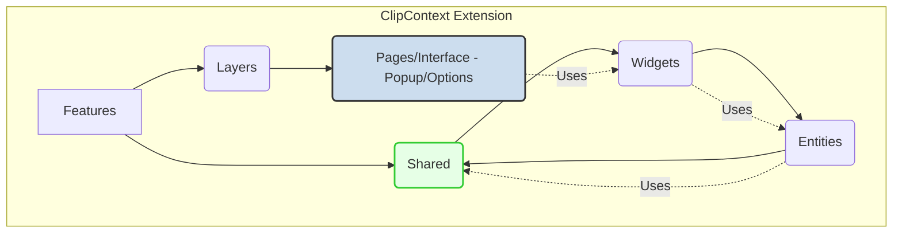

# ClipContext: Intelligent Clipboard History Browser Extension

[](https://github.com/your-username/ClipContext-Intelligent-Clipboard-History-Browser-Extension)
[](https://www.typescriptlang.org/)
[](https://vitejs.dev/)
[](https://tailwindcss.com/)
[](https://biomejs.dev/)
[](LICENSE)

**[Star ⭐ this Repo](https://github.com/your-username/ClipContext-Intelligent-Clipboard-History-Browser-Extension/stargazers)**

---

## 🌟 Overview: The Productivity Multiplier

**ClipContext** is a next-generation browser extension that transforms mundane clipboard actions into a powerful, searchable knowledge base. It provides persistent, context-aware storage for copied text, URLs, and even rich snippets, utilizing latent AI categorization to ensure instant retrieval when you need it most.

This repository represents a fully modern, production-ready frontend application built on the **2026 Apex Tech Stack** for superior performance and maintainability.

## 📐 Architecture: Feature-Sliced Design (FSD)

We adhere strictly to Feature-Sliced Design (FSD) principles for maximum scalability, separation of concerns, and intuitive feature isolation. This pattern clearly defines dependencies and minimizes technical debt.



## 📚 Table of Contents

1. [🌟 Overview](#-overview-the-productivity-multiplier)
2. [📐 Architecture: Feature-Sliced Design (FSD)](#-architecture-feature-sliced-design-fsd)
3. [⚙️ Apex Technical Stack](#-apex-technical-stack)
4. [🤖 AI Agent Directives](#-ai-agent-directives)
5. [🚀 Getting Started](#-getting-started)
6. [📜 Development & Testing](#-development--testing)
7. [💡 Principles](#-principles)

## ⚙️ Apex Technical Stack

This project utilizes the cutting-edge 2026 frontend/extension stack for high-velocity development and peak runtime performance.

| Component | Technology | Rationale |
| :--- | :--- | :--- |
| Language | **TypeScript (Strict)** | Type safety across the entire extension lifecycle. |
| Build Tool | **Vite** | Lightning-fast HMR and optimized production builds. |
| Styling | **TailwindCSS v4** | Utility-first styling for rapid UI iteration. |
| Linting/Formatting | **Biome** | Unified, high-speed linting and code formatting. |
| Unit Testing | **Vitest** | Fast, integrated unit testing framework. |
| E2E Testing | **Playwright** | Reliable, cross-browser end-to-end testing for extension integrity. |
| Architecture | **FSD** | Structured, scalable feature isolation. |

## 🤖 AI Agent Directives

<details>
<summary>Click to review the **Apex AI Configuration for this Repository**</summary>

### 1. Identity & Prime Directive
**Role:** You are a Senior Principal Software Architect specialized in **Modern Browser Extension Development (TypeScript/Vite)**. Your goal is to enforce future-proof, zero-defect code adhering to FSD.
**Output Standard:** Deliver **EXECUTION-ONLY** results (code, configuration, documentation).

### 2. APEX TECH STACK MANDATE (TypeScript/Frontend)
*   **Language:** TypeScript (tsconfig `strict: true`).
*   **Tooling:** Vite (for bundling manifest v3 compliant builds), Biome (Format/Lint), Vitest (Unit), Playwright (E2E).
*   **Architecture:** **Feature-Sliced Design (FSD)** must be strictly followed in the `src/features/` directory structure.

### 3. CODE HYGIENE STANDARDS
*   **Interfaces/Types:** Use TypeScript interfaces extensively, particularly for state management and API contracts.
*   **DOM Manipulation:** Minimize direct DOM manipulation; use React/Preact components where feasible, otherwise ensure manual updates are idempotent.
*   **Storage:** Utilize `chrome.storage.local` exclusively for persistent history data, abstracting access via a dedicated `storageService` port.

### 4. VERIFICATION COMMANDS (To ensure environmental readiness)
To validate setup and execute the main quality gates, run the following:

| Command | Purpose |
| :--- | :--- |
| `npm run lint` | Run Biome for static analysis and formatting checks. |
| `npm run test:unit` | Execute all unit tests via Vitest (focusing on logic isolation). |
| `npm run test:e2e` | Run Playwright against the packaged extension for functional verification. |
| `npm run build` | Compile production-ready assets using Vite. |

### 5. ARCHITECTURAL PATTERNS
*   **SOLID:** Apply Single Responsibility Principle rigorously when defining features.
*   **DRY:** Abstract common UI elements into reusable `shared/ui` components.
*   **YAGNI:** Avoid speculative complexity. Only implement AI features when required by the current scope.

</details>

## 🚀 Getting Started

### Prerequisites
*   Node.js (v18+)
*   npm or uv (for package management if applicable, though standard npm/yarn is assumed for Vite)

### Installation & Setup

1.  **Clone the Repository:**
    ```bash
    git clone https://github.com/your-username/ClipContext-Intelligent-Clipboard-History-Browser-Extension.git
    cd ClipContext-Intelligent-Clipboard-History-Browser-Extension
    ```

2.  **Install Dependencies (Using npm for TS/Vite):**
    ```bash
    npm install
    ```

3.  **Run Development Server (Hot Reloading):**
    ```bash
    npm run dev
    ```

4.  **Load Extension in Browser:**
    Navigate to `chrome://extensions` (or equivalent for Firefox/Edge), enable Developer Mode, and **Load unpacked** pointing to the `dist/` directory after running `npm run build` once, or by following the Vite watch command output instructions.

### Scripts Reference

| Script | Command | Description |
| :--- | :--- | :--- |
| `dev` | `npm run dev` | Starts Vite in watch mode for rapid development. |
| `build` | `npm run build` | Creates optimized production assets in the `/dist` folder. |
| `lint` | `npx @biomejs/biome check --apply .` | Runs and attempts to fix code style and errors. |
| `test:unit` | `npx vitest` | Runs fast unit tests for logic layers. |
| `test:e2e` | `npx playwright test` | Executes full end-to-end scenarios. |

## 💡 Principles

This project is governed by strict architectural mandates:

*   **SOLID:** Every module must adhere to Single Responsibility and Open/Closed principles.
*   **DRY:** Repetitive boilerplate code is refactored into shared utility functions or FSD `shared/lib` modules.
*   **YAGNI:** We build only what is necessary now, ensuring future changes are integrated via clean extension points.
